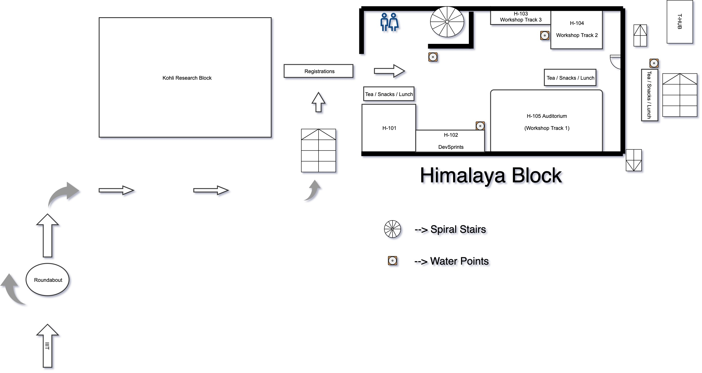
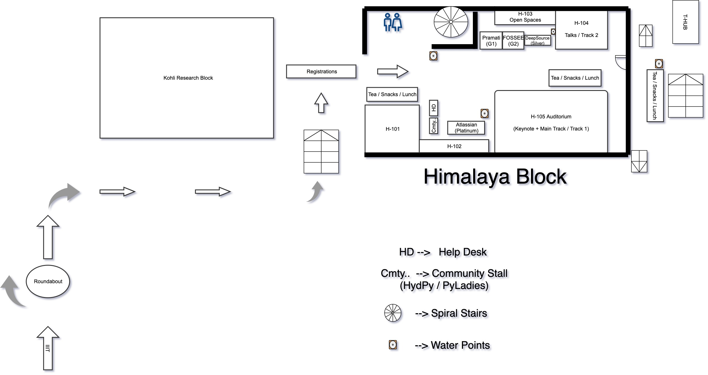

To make the conference more accessible we are taking certain measure to understand what could be done for making conference venue seamlessly accessible and also to help people with different abilities to attend conference without any issues.

Please read about the measures taken and help us with more suggestions you may have –

- We’ll arrange two wheel chairs on conference and workshop day for people with different ability
- All tracks on both workshop and conference day and lunch area are wheelchair accessible.
- Washrooms are wheelchair accessible at the venue
- The Volunteers and attendees will be briefed on the importance of this
- Full Session Schedule is provided at backside of Notebooks and ID Cards
- Floor map will be provided before the conference to each of the participant
- A quick brief will be given before start of workshop/conference to all differently-abled people along with volunteers for seamless experience
- Signboards are used in the entire pathways to better access to the venue
- Few chairs are reserved in the front for people with visual and hearing disabilities
- Dedicated Volunteers will be available to look over accessibility aspect
- We’d also assign volunteers to people who are differently abled on request basis
- We’d also be sharing an email before the conference asking if someone would need assistance
- Unfortunately, we’re not providing day care facility to kids coming to conference along side their parents

### Venue layout:

#### Workshop

**[Download Workshop Layout](assets/pyconf_workshop_day.pdf)**

#### Conference

**[Download Conference Layout](assets/pyconf_conference_day.pdf)**

For any queries/suggestion please contact us at **<contact@hydpy.org>**
