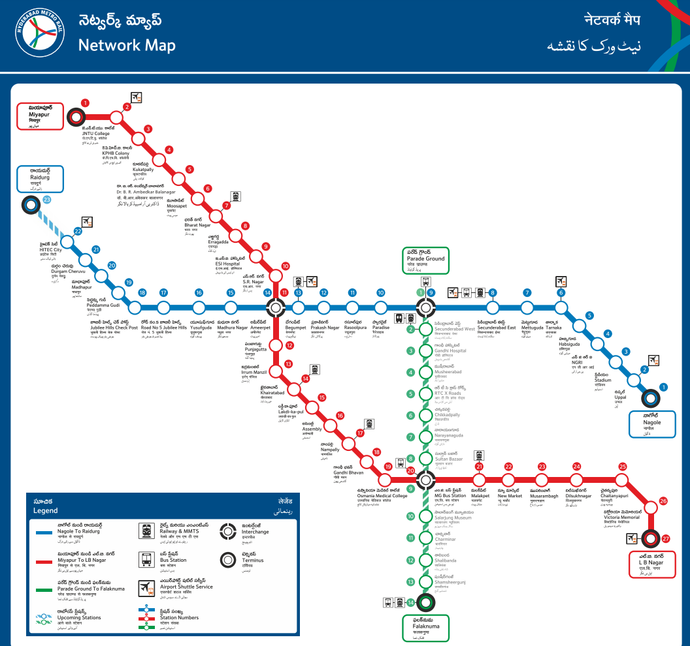

# About

This page is to help attendees to find various ways to Reach PyConf Hyderabad 2019 happening at Hyderabad, India. Here is a [handy Wiki page](https://wikitravel.org/en/Hyderabad#Get_in) describing about the various ways you can travel to Hyderabad. The main points have been highlighted below.

## By Plane - Rajiv Gandhi International Airport

#### To Hyderabad:

 Domestic connectivity to Hyderabad is excellent with major Indian airlines such as Air India, Indigo Airlines, Jet Airways, Trujet and SpiceJet.

**From the Airport to the Venue:** Once you arrive at Rajiv Gandhi International Airport, one option is to take the air-conditioned buses run by the airport (Pushpak) to Gachibowli (Near Outer-Ring-Road(ORR)). It will cost approx. 250 INR. The buses have a frequency of every 30 min from 3:30AM-12AM and every hour at midnight, 1AM, 2AM and 3AM. The travel time varying from 45 mins to 2 hrs depending on time of the day and traffic conditions. [Here are the timings of various buses from the airport](http://www.hyderabad.aero/to-from-airport.aspx). Take a bus from **RGIA TO Gachibowli**. You can reach the designated points and then take an auto or metered cab from there to reach the venue.

Alternatively, you can hire metered air-conditioned radio cabs. Skycabs and Meru are approved by the airport itself @ 21 INR/km and are available just after exiting the terminal building. For the rest, you need to call and book with a lead time of 15 minutes to 1 hour. These cabs charge 25% surcharge in the night (ie, between 23:00 hours and 05:00 hours). Hyderabad traffic police counter is on the ground floor with prepaid taxis.

**Beware of taxi soliciting tours at the airport greeting area; they might try to scam you into paying exorbitant rates (especially so in case of non-locals)**. The Hyderabad Traffic Police has partnered with the Airport authorities to run a counter for prepaid taxis. This is a safe option as all taxis are registered with the police. The police also runs a **SHE cab service** now, especially for women travellers, with female drivers and safety equipment such as a GPS connected to the Police Control Room.

One can also hire a cab from many app-based services such as **Uber** or **Ola** directly to the Venue which are readily available in Hyderabad.

If 3-4 of you are travelling together, then it is possible to directly take a cab as it will be cheaper (Please keep in mind that while these services are substantially cheaper than the radio cabs, they will charge Rs. 200 in addition to the fare as parking charges levied on them by the airport). This option is the best while travelling to the airport, as the parking charges do not apply for departures.

Hired cars are also available from a booth just before walking outside of the airport. This gives you the advantage of paying in advance, thereby avoiding any disagreements over price. The airport can be contacted on their (toll free for BSNL/MTNL subscribers) number 1 800 419-2008 for all services and inquiries including arrivals/departure information, facilities, transport availability, etc.

## By Train - Secundrabad or Hyderabad

#### To Hyderabad:

Indian Railways has service to Hyderabad from all over India. There are three major railway stations serving the twin cities: **Secunderabad, Hyderabad , Kachiguda** and a minor station at **Begumpet**. Hyderabad Deccan Station is popularly known as **Nampally Station**. Most of the trains bound for South India and North India originate from Hyderabad,and leave via Secunderabad.

* [Trains to Secundrabad](https://trainspy.com/static/station/(SC)SECUNDERABAD-JN)
* [Trains to Hyderabad - Deccan](http://trainspy.com/static/station/(HYB)HYDERABAD-DECAN)
* [Trains to Kachiguda](http://trainspy.com/static/station/(KCG)KACHEGUDA)

Secundrabad and Kachiguda are almost the same distance from the venue (~40 kms). Hyderabad (Nampally) Station is ~15 kms from the venue. Using the above links, you can check which trains you can get from your region.

**From the stations to the venue:**
From any station you have can take a bus to Gachibowli (ORR). Just point Google Map from your location to Gachibowli and you will get the bus numbers you need to board from the station bus stop. From Gachibowli you can take a cab or auto reach the venue.

**By Metro**

The Hyderabad Metro is a rapid transit system, serving the city of Hyderabad, Telangana, India. It is the second longest operational metro network in India.

**From Secundrabad:** (Metro Station number 8 in Blue Line) A Metro station is constructed near secundrabad railway station within a walkable range.The  blue line from below image is route to reach to Hi-Tech city (Metro Station number 22 in Blue Line). From Hi-tech city you can take any road transport to reach the destination.

**From Nampally:** (Metro Station number 17 in red line)The Red line from the below image is the metro to take to reach **Ameerpet**(Metro Station number 11 in red line), from Ameerpet you need to change the platform and follow the blue line from image to reach to Hi-Tech city(Metro Station number 22 in Blue Line). From Hi-tech city you can take any road transport to reach the destination.

[Network-Map-Metro](https://www.ltmetro.com/metro-network-map/)

You can also get a cab from these stations to the venue directly. **Ola** and **Uber** are 2 popular cab services in the area. You can use their app to book a cab.

## By Car

Hyderabad is well connected to other major cities by road. Bangalore is connected by NH7 and is at a distance of 560 km. The city is 752 km from Chennai (using highways NH9 and NH5) and 800 km from Mumbai (NH9 till Pune and the expressway to Mumbai.) The Bangalore - Hyderabad section is part of the North South corridor which is being upgraded to a four-lane divided highway.

## By Bus

**To Hyderabad:** Hyderabad is well-connected to all parts of the Telangana and most parts of South and Western India. Both state government and private buses operate large number of luxury and ordinary services across the state and neighboring states.

**JBS, (Jubilee Bus station),** is in Secunderabad. TSRTC runs direct A/C coaches to Mumbai, Bengaluru (Bangalore) and Chennai. Telangana tourism runs A/C coaches to, Mumbai, Chennai and Bengaluru. You have to book the tickets in advance. There are many online bus ticketing portals to book bus tickets. Mybustickets is one such portal.

**MGBS or Imliban,**is said to be the largest bus station in the world with around 84 bus bays side by side. TSRTC has pickup and drop points from various points in the city. In addition, government-run bus services of neighboring states also run buses to Hyderabad, as do various private companies.

**Private Buses** South India is largely well served by organised private bus operators. They run luxury buses like Volvo, Mercedes, Kinglong Cerita buses including multi axle buses. These are air-conditioned, semi sleeper or sleeper services with online ticket booking facilities. Important private travel hubs are KPHB Colony, Lakdi-Ka-Pool, Paradise centre in Secunderabad and Dilsukh nagar. Luxury services run to many cities from these places. Non-metropolitan areas and towns are often connected by non-A/C buses but are still provided with comfortable seating.
It may be difficult to find direct buses from North India due large size of that part of the country.

**From the Bus stand to the venue:**
* [JBS to Gachibowli City (IIIT Hyderabad)](https://www.google.co.in/maps/dir/Jubilee+Bus+Station,+Gandhi+Nagar,+Nehru+Nagar+Colony,+West+Marredpally,+Secunderabad,+Telangana+500026/Bus+stop+IIITH,+Old+Mumbai+Highway,+TCS+Synergy+park,+Indian+Immunologicals+Colony,+Gachibowli,+Hyderabad,+Telangana/@17.4151085,78.3937167,13z/data=!3m1!4b1!4m14!4m13!1m5!1m1!1s0x3bcb9a3e20505cdb:0xa6d0eb22d13169c6!2m2!1d78.4981525!2d17.4477577!1m5!1m1!1s0x3bcb935d9dcbf001:0x88b77ba3e0599247!2m2!1d78.3511163!2d17.4464139!3e3)
* [MGBS to Gachibowli City (IIIT Hyderabad)](https://www.google.co.in/maps/dir/MGBS+Bus+Stand,+Gowliguda+North,+Gowliguda,+Hyderabad,+Telangana/Bus+stop+IIITH,+Old+Mumbai+Highway,+TCS+Synergy+park,+Indian+Immunologicals+Colony,+Gachibowli,+Hyderabad,+Telangana/@17.4122356,78.3829749,13z/data=!3m1!4b1!4m14!4m13!1m5!1m1!1s0x3bcb982d09e67201:0x22cc2ebd6842c8be!2m2!1d78.4842753!2d17.3787197!1m5!1m1!1s0x3bcb935d9dcbf001:0x88b77ba3e0599247!2m2!1d78.3511163!2d17.4464139!3e3)

From the drop point you could walk to the venue.
You can also get a cab from these bus stops to the venue directly.

**If you want more details or have any inquiries, please contact <u>contact@hydpy.org .</u>**